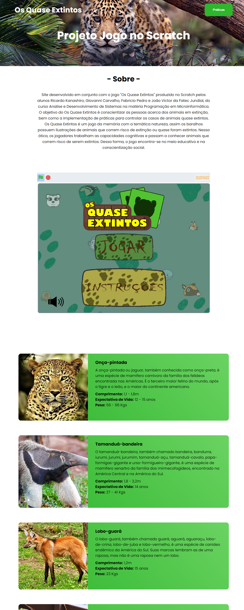
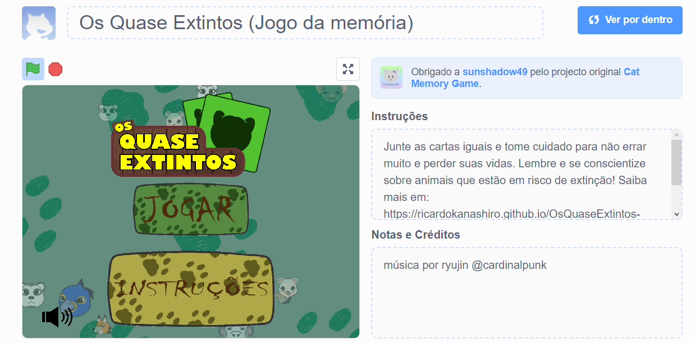
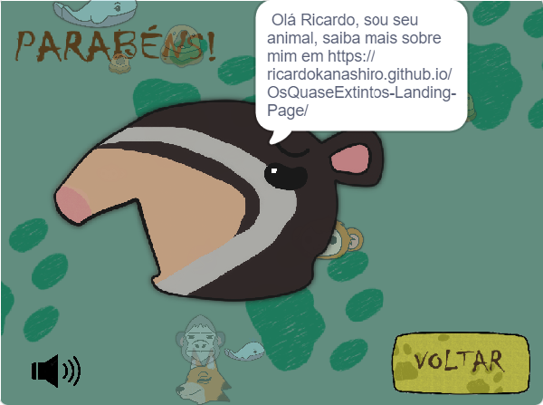

<h1 align="center">Microinformática - Projeto Jogo Scratch - Site</h1>

    

    

## Used Techs:

O projeto inteiro foi desenvolvido usando as seguintes tecnologias: 

    
    
    

## About this project:

Este foi um site produzido em conjunto com um jogo no Scratch "Os Quase Extintos" onde traz mais informações sobre os animais em extinção mostrados no jogo e alguns meios de prevenção. Esse jogo foi produzido no Scratch nas aulas de Microinformática no primeiro semestre do curso Análise e Desenvolvimento de Sistemas na Fatec Jundiaí pelos alunos Ricardo Kanashiro, Giovanni Carvalho, João Victor e Fabrício Pedro, e se baseia em um jogo da memória com o desenho de alguns animais em extinção. <a href="https://scratch.mit.edu/projects/822490165">CONFIRA O JOGO</a>

    

    

